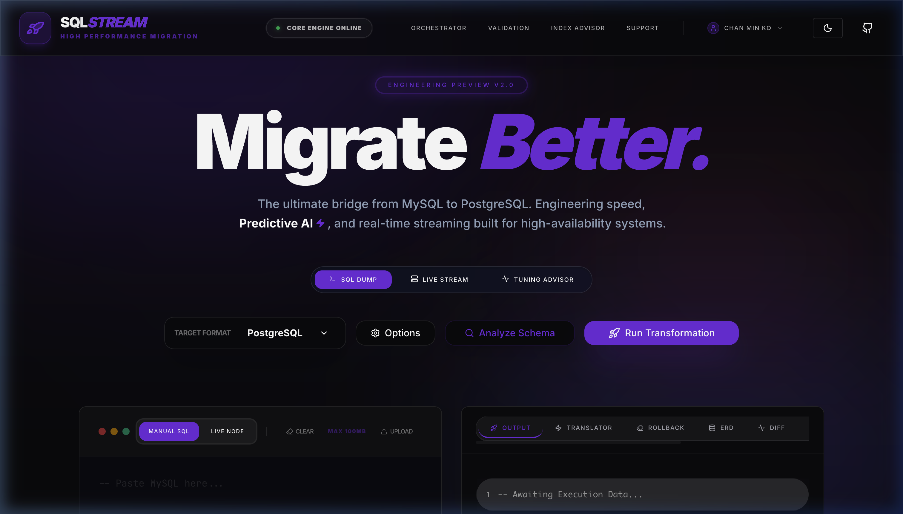
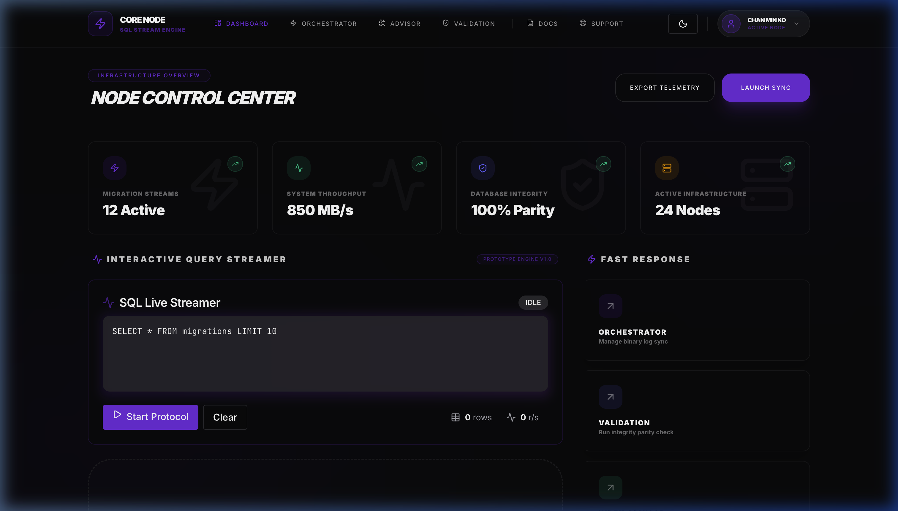
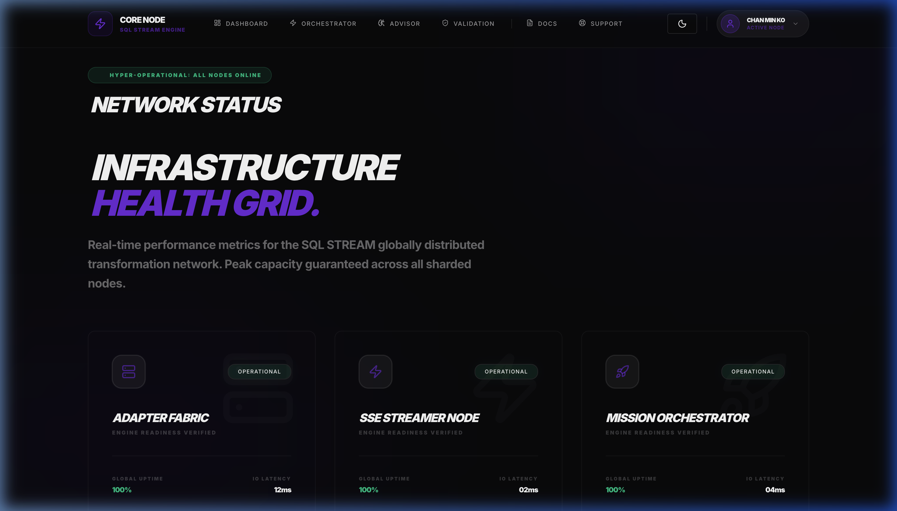

# SQLStream 🚀
> Real-time SQL result streaming for Laravel via SSE.

[](https://laravel.com)
[](https://react.dev)
[](https://tailwindcss.com)
[](LICENSE)


**SQLStream** is a high-performance SQL result streaming platform that utilizes **Server-Sent Events (SSE)** to deliver real-time data from diverse database engines directly to a premium, glass-morphic frontend. 

---

## 📸 System Showcase


| Landing Page | Interactive Dashboard |
| :---: | :---: |
|  |  |

| Infrastructure Health | Engineering Documentation |
| Engineering Landing Ecosystem | Node Control Center |
| :---: | :---: |
|  |  |

---

## ✨ Key Features

- ⚡ **Real-Time SSE Streaming**: Instant data delivery using high-performance PHP Generators and DB Cursors.
- 🌳 **Multi-Database Strategy**: Native support for **Postgres, MySQL, SQLite, Oracle, and SQL Server**.
- 📊 **Interactive Telemetry**: High-fidelity data table with spring-animations and CSV/Clipboard export.
- 🌫️ **Engineering Node UI**: A mission-critical, glass-morphic design built with Tailwind CSS 4.
- 🛡️ **Hardened Security**: Built-in SSRF protection and strict Read-Only SQL enforcement.
- 🔐 **SSO Ready**: Seamless identity federation via GitHub and Google.

---

## 🏗️ Project Structure

```bash
├── app/
│   ├── Http/Controllers/
│   │   └── SseController.php        # Core SSE Protocol Handler
│   ├── Services/
│   │   ├── DatabaseAdapters/       # Strategy Pattern Adapters (MySQL, Postgres, etc.)
│   │   └── SQL/
│   │       └── QueryStreamerService.php # Generator-based Streaming Logic
│   └── Traits/
│       └── ValidatesDatabaseHost.php # SSRF Security Layer
├── resources/js/
│   ├── Components/
│   │   ├── SQLStreamer.tsx        # Live Terminal Component
│   │   └── StreamingDataTable.tsx # High-performance Data Grid
│   └── Pages/                      # Inertia.js Dashboard & Status Nodes
└── routes/web.php                  # Protocol Route Definitions
```

---

## 🚀 Getting Started

Establish your mission-critical SQLStream node with the following engineering protocol.

### 📋 Prerequisites

Before initialization, ensure your infrastructure meets the following specifications:
- **PHP**: ^8.2 (with JSON and PDO extensions)
- **Node.js**: ^20.x (LTS recommended)
- **Database**: PostgreSQL (Sink), MySQL/Oracle/Sqlite (Source nodes)
- **Composer**: ^2.6

### 🛠️ Installation Protocol

1. **Clone the Repository**
   ```bash
   git clone https://github.com/chanminko1234/SQLSTREAM_REPO.git
   cd SQLSTREAM_REPO
   ```

2. **Initialize Backend Environment**
   ```bash
   composer install
   cp .env.example .env
   php artisan key:generate
   ```

3. **Configure the Matrix (`.env`)**
   Update your database credentials to enable local streaming. Ensure your `DB_CONNECTION` is set to your target PostgreSQL engine.
   ```env
   DB_CONNECTION=pgsql
   DB_HOST=127.0.0.1
   DB_PORT=5432
   DB_DATABASE=sql_stream
   DB_USERNAME=postgres
   DB_PASSWORD=your_password
   ```

4. **Prepare the Data Fabric**
   ```bash
   php artisan migrate --seed
   ```

5. **Deploy Frontend Build**
   ```bash
   npm install
   npm run dev
   ```

6. **Engage Node**
   Launch your local development server:
   ```bash
   php artisan serve
   ```
   Accessible at: `http://localhost:8000`

---

## 🧠 Technical Insight: Why SSE?

SQLStream utilizes **Server-Sent Events (SSE)** for all real-time data telemetry. While WebSockets are excellent for bi-directional communication (like chat), SSE is the superior architectural choice for unidirectional SQL result streaming.

### ⚖️ SSE vs. WebSockets
1. **Lightweight Protocol**: SSE operates over standard HTTP. It doesn't require the complex handshake or custom server logic that WebSockets demand, reducing server overhead.
2. **Automatic Reconnection**: Browsers natively handle reconnections for SSE. If the network drops, the `EventSource` automatically attempts to re-establish the stream without custom JavaScript logic.
3. **Firewall Friendly**: Since SSE is just standard HTTP/2, it sidesteps many of the corporate firewall and proxy issues that often block WebSocket traffic.

### 🛠️ Laravel Backend Orchestration
The Laravel backend utilizes a mission-critical streaming stack:
- **`StreamedResponse`**: Leverages Symfony's underlying stream handler to pipe data directly to the client.
- **PHP Generators**: We use `yield` within our database loops. This ensures that only a single row resides in memory at any given time, allowing us to stream millions of records with O(1) memory complexity.
- **Buffer Management**: Our controller explicitly executes `ob_end_flush()` and `flush()` after every row. This bypasses the default output buffering, ensuring the frontend receives rows the millisecond they are fetched from the database cursor.

---

## 🤝 Contributing
Contributions are what make the open-source community an amazing place to learn, inspire, and create. Any contributions you make are **greatly appreciated**.

1. Fork the Project
2. Create your Feature Branch (`git checkout -b feature/AmazingFeature`)
3. Commit your Changes (`git commit -m 'Add some AmazingFeature'`)
4. Push to the Branch (`git push origin feature/AmazingFeature`)
5. Open a Pull Request

---

## 👨‍💻 Author
**Chan Min Ko**
- GitHub: [@chanminko1234](https://github.com/chanminko1234)
- Twitter: [@chan_min_ko_24](https://x.com/chan_min_ko_24)

---

## 📜 License
Distributed under the MIT License. See `LICENSE` for more information.

*Engineered with precision for the next generation of data streaming.*
